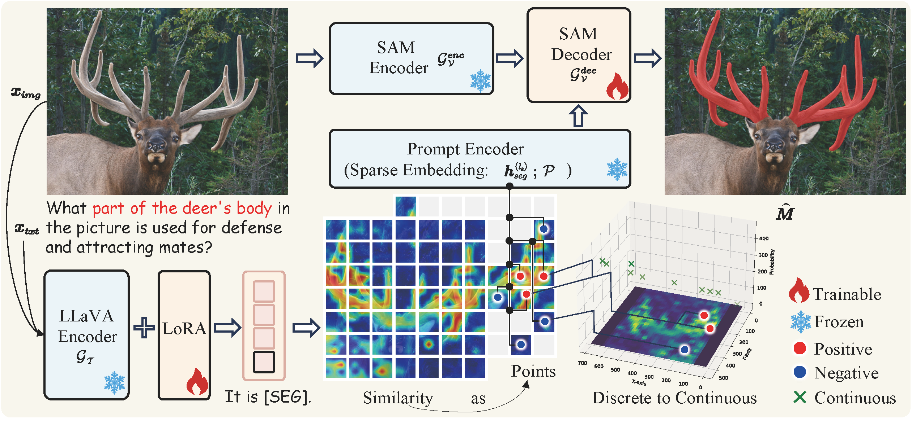
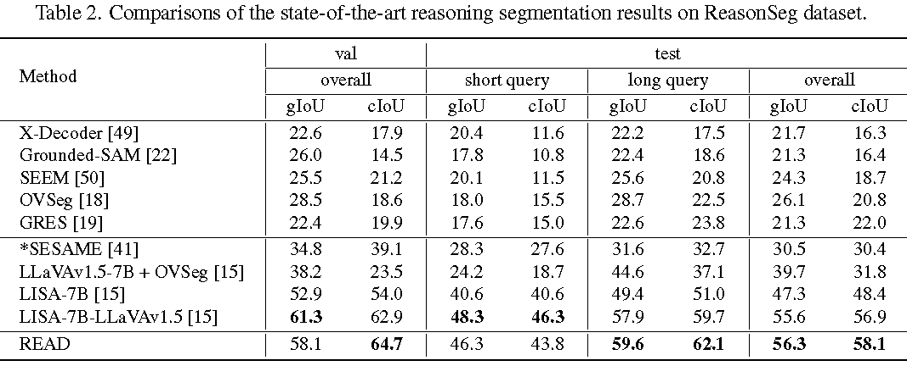
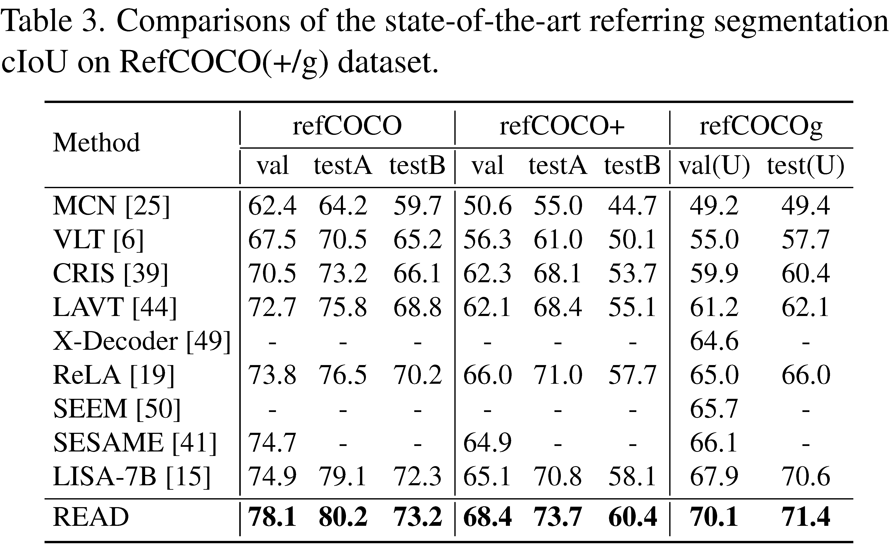

# Reasoning to Attend: Try to Understand How \<SEG\> Token Works

[](https://lbesson.mit-license.org/)  [](https://arxiv.org/abs/2412.17741) 

This repo provides the PyTorch source code of our paper: [Reasoning to Attend: Try to Understand How \<SEG\> Token Works](https://arxiv.org/abs/2412.17741).

**Authors**: 
[Rui Qian](https://scholar.google.com.hk/citations?user=z3sAW3oAAAAJ&hl=zh-CN), 
[Xin Yin](https://scholar.google.com.hk/citations?hl=zh-CN&user=v3OOQQkAAAAJ), 
[Dejing Dou†](https://scholar.google.com.hk/citations?hl=zh-CN&user=qBHsQ04AAAAJ). 

## Abstract
Current Large Multimodal Models (LMMs) empowered visual grounding typically rely on \<SEG\> token as a text prompt to jointly optimize the vision-language model (e.g., LLaVA) and the downstream task-specified model (\eg, SAM). However, we observe that little research has looked into how it works. In this work, we first visualize the similarity maps, which are obtained by computing the semantic similarity between the \<SEG\> token and the image token embeddings derived from the last hidden layer in both the LLaVA encoder and SAM decoder. Intriguingly, we have found that a striking consistency holds in terms of activation responses in the similarity map, which reveals that what \<SEG\> token contributes to is the semantic similarity within image-text pairs. 
Specifically, \<SEG\> token, a placeholder expanded in text vocabulary, extensively queries among individual tokenized image patches to match the semantics of an object from text to the paired image while the Large Language Models (LLMs) are being fine-tuned. Upon the above findings, we present \toolname, which facilitates LMMs' resilient **REA**soning capability of where to atten**D** under the guidance of highly activated points borrowed from similarity maps. Remarkably, READ features an intuitive design, Similarity as Points module (SasP), which can be seamlessly applied to \<SEG\>-like paradigms in a plug-and-play fashion.
Also, extensive experiments have been conducted on the ReasonSeg and RefCOCO(+/g) datasets. To validate whether READ suffers from 
catastrophic forgetting of previous skills after fine-tuning, we further assess its generation ability on an augmented FP-RefCOCO(+/g) dataset. All codes and models are publicly available at 
[https://github.com/rui-qian/READ](https://github.com/rui-qian/READ).
<p align="center">  </p>
<p align="center">  </p>

## News
- [x] [2025.1.4] We will release [READ-LLaVA-v1.5-13B](https://huggingface.co/rui-qian) for ReasonSeg dataset as soon as possible, stay tuned!
- [x] [2025.1.4] Inference code and the [READ-LLaVA-v1.5-7B](https://huggingface.co/rui-qian/READ-LLaVA-v1.5-7B-for-ReasonSeg-valset) model are released. Welcome to check them out!
- [x] [2024.12.24] [Paper](https://arxiv.org/abs/2412.17741) is released and GitHub repo is created.

## Installation Guide

### System Requirements

- System Setup: Linux with one or more Nvidia A100 GPUs (Ampere GPUs required due to flash-attn usage during training). Minor adjustments may be necessary for Mac or Windows.
- Dependency Installation: Create a Python environment named "sesame" and install necessary dependencies:

```bash=
conda create -n read python=3.9
pip3 install pybind11==2.11.1
pip3 install -r requirements.txt 
pip install flash-attn --no-build-isolation
```
We primarily follow the installation steps of [SESAME](https://github.com/see-say-segment/sesame). As long as your program can run the SESAME model, it should be able to run our model as well.
In addition, we also provide conda environment contents in a .zip file. Please follow the below steps to set up the environment, 
- Download `read_conda_env.zip` from the [google_drive link](https://await).
- Extract the downloaded `zip` file: 
```bash
bash Anaconda3-2024.06-1-Linux-x86_64.sh
conda create -n read python=3.9
unzip read_conda_env.zip #(unzip to obtain read env)
cp -a ./read anaconda3/envs #replace
```
- Activate the environment: 
```bash
conda activate read
```

## Model and Dataset Preparation

Links to [FP-RefCOCO* Datasets](https://drive.google.com/file/d/1mA3kcY3QiAZz1Zr89MCKYd7e3LBIwUzl/view?usp=sharing), and [Huggingface Model Collections](https://huggingface.co/collections/tsunghanwu/sesame-666c9b43efff2acaafc61882) are available. Visit [SESAME dataset page](./dataset/README.md) for more details.

Currently, we release three models are specifically trained for Reasoning segmentation tasks, (FP-)referring segmentation tasks. Below are key notes and the cIoU score of these models. 

| Model Name | HG-ckpt URL | 
|----------------------------|----------------|
| SESAME-    LLaVA-v1.5-7B  | [tsunghanwu/SESAME_minus](https://huggingface.co/tsunghanwu/SESAME_minus) |  
| SESAME    LLaVA-v1.5-7B  | [tsunghanwu/SESAME](https://huggingface.co/tsunghanwu/SESAME) |   
| READ-LLaVA-v1.5-7B-for-fprefcoco **(ours)**  | [rui-qian/READ-fprefcoco](https://huggingface.co/rui-qian/READ-LLaVA-v1.5-7B-for-fprefcoco) | 
| READ-LLaVA-v1.5-7B-for-ReasonSeg-valset **(ours)**  | [rui-qian/READ-ReasonSeg-valset](https://huggingface.co/rui-qian/READ-LLaVA-v1.5-7B-for-ReasonSeg-valset) | 
| READ-LLaVA-v1.5-7B-for-ReasonSeg-testset **(ours)**  | [rui-qian/READ-ReasonSeg-tesset](https://huggingface.co/rui-qian/READ-LLaVA-v1.5-7B-for-ReasonSeg-testset) | 

**Notes**
- All performance numbers above are evaluated using the validation split.
- Instead of training from scratch, we initialize the parameters via the released model of [SESAME](https://huggingface.co/tsunghanwu/SESAME) for the sake of acceleration.
- The SESAME- model is exclusively trained with RefCOCO* data, according to [SESAME](https://github.com/see-say-segment/sesame).
- The SESAME model is trained with multiple datasets: LLaVA VQA, RefCOCO*, R-RefCOCO*, and the proposed FP-RefCOCO* data, according to [SESAME](https://github.com/see-say-segment/sesame)
## Experimental results 
## Results on ReasonSeg Dataset
<p align="left">  </p>

## Results on ReasonSeg Dataset
<p align="left">  </p>

## Results on FP-RefCOCO(+/g) Dataset
<p align="left">  </p>

See also: You can download the predicted results on FP-RefCOCO(+/g) [here](https://huggingface.co/datasets/rui-qian/FP-refcoco)!


</details>

## Training

### Pre-trained weights
#### SAM ViT-H weights
Download SAM ViT-H pre-trained weights from the [link](https://dl.fbaipublicfiles.com/segment_anything/sam_vit_h_4b8939.pth).
#### LLaVA
To train READ-7B or 13B from scratch, you need to download
```
huggingface-cli download  --resume-download liuhaotian/llava-v1.5-7b --local-dir llava-v1.5-7b
huggingface-cli download  --resume-download liuhaotian/llava-llama-2-13b-chat-lightning-preview --local-dir llava-llama-2-13b-chat-lightning-preview
```
or fine-tune SESAME models directly by simply running ours scripts: **[./train_read.sh](./train_read.sh)**
```
vim SESAME-LLaVA-v1.5-7B/config.json
  "architectures": [
    "SESAMEForCausalLM" -->(modify) "READForCausalLM"
  ],

deepspeed --include $GPU_SETTINGS --master_port=$MASTER_PORT train_read.py \
      --version="$VERSION" \
      --model_max_length="$MODEL_MAX_LENGTH" \
      --vision_tower="$VISION_TOWER" \
      --dataset_dir="$DATASET_DIR" \
      --vision_pretrained="$VISION_PRETRAINED" \
      --exp_name="$EXP_NAME" \
      --dataset="$DATASET_REASONSEG" \
      --sample_rates="$SAMPLE_RATES_REASONSEG" \
      --batch_size=$BATCH_SIZE \
      --grad_accumulation_steps $GRAD_ACCUMULATION_STEPS \
      --num_classes_per_sample=$NUM_CLASSES_PER_SAMPLE \
      --auto_resume \
      --lr=0.0001
```
Since the ReasonSeg dataset is quite small, it is recommended to use a smaller learning rate of 0.0001 (instead of the original 0.0003) if you are about to fine-tune based on SESAME models. 8 epoches should be able to reproduce our results on ReasonSeg dataset. As for more details, please refer to **[train_read.sh](./train_read.sh)**.
### Merge LoRA Weight
When training is finished, to get the full model weight:
```
cd ./runs/lisa-7b/ckpt_model && python zero_to_fp32.py . ../pytorch_model.bin 
```
or using script **[merge_lora_weight.sh](./merge_lora_weight.sh)** 

### Validation on ReasonSeg and refcoco(+/g) series

To validate on ReasonSeg and referring segmentation dataset, by simply running ours scripts: **[./val_read.sh](./val_read.sh)**.   You may modify the parameters accordingly if needed.

```
# uncomment to eval for ReasonSeg val set
deepspeed --master_port=24996 --include "localhost:0" train_read.py \
       --version="./READ-LLaVA-v1.5-7B-for-ReasonSeg-valset" \
       --dataset_dir='../dataset' \
       --vision_pretrained="../dataset/sam_vit_h_4b8939.pth" \
       --eval_only \
       --vision_tower="../dataset/clip-vit-large-patch14-336" \
       --model_max_length=2048 \
       --val_dataset="ReasonSeg" \
       --val_split="val"
```

### Validation on FP-refcoco(+/g) series

Unlike the ReasonSeg and RefCOCO(+/g) datasets, where the dataset contains only positive samples and evaluation focuses solely on segmentation performance, the `<seg>` token is directly added to the question template during validation. However, the FP-RefCOCO dataset includes False Premises (negative samples), so the `<seg>` token cannot be directly appended to the question template. Instead, the model must predict based on the actual query. You 
can simply run ours scripts: **[./test_read.sh](./test_read.sh)**. 
```
CUDA_VISIBLE_DEVICES="${CUDA_DEVICE}" python test_read.py \
    --cmd="${INFERENCE_CMD}" \
    --local_rank=0 \
    --process_num="${PROCESS_NUM}" \
    --world_size="${WORLD_SIZE}" \
    --dataset_dir ../dataset \
    --pretrained_model_path="./READ-LLaVA-v1.5-7B-for-fprefcoco" \
    --vision_tower="../dataset/clip-vit-large-patch14-336" \
    --model_max_length=2048 \
    --val_dataset="${DATASET}" \
    --vis_save_path="./inference_results/${DATASET}_inference_cvpr"
```
As mentioned in [SESAME](https://github.com/see-say-segment/sesame), inference is highly time-consuming. Using a single A100 80G GPU, it takes approximately 8-9 hours to perform inference on a RefCOCO(+/g) series dataset.


## Inference (Demo)

To chat with [READ-LLaVA-v1.5-7B](READ-LLaVA-v1.5-7B-for-fprefcoco) 
```
export CUDA_VISIBLE_DEVICES=0,1,2,3
python demo.py \
    --pretrained_model_path="../READ-LLaVA-v1.5-7B-for-fprefcoco" \
    --vision_tower="../dataset/clip-vit-large-patch14-336" \
    --model_max_length=2048
```

## Acknowledgements

We are grateful for the foundational code provided by [SESAME](https://github.com/see-say-segment/sesame), [CLIP_Surgery](https://github.com/xmed-lab/CLIP_Surgery),[LISA](https://github.com/dvlab-research/LISA), [LLaVA](https://github.com/haotian-liu/LLaVA), and [SAM](https://github.com/facebookresearch/segment-anything). Utilizing their resources implies agreement to their respective licenses. Our project benefits greatly from these contributions, and we acknowledge their significant impact on our work.

## Citation

If you use our work or our implementation in this repo, or find them helpful, please consider giving a citation.
```
@inproceedings{qian2024reasoning,
  title={Reasoning to Attend: Try to Understand How< SEG> Token Works},
  author={Qian, Rui and Yin, Xin and Dou, Dejing},
  journal={arXiv preprint arXiv:2412.17741},
  year={2024}
}
```
## Contact
If you have any questions, feel free to reach out at qianruii@126.com, xyin@zju.edu.cn, and dejingdou@gmail.com.
