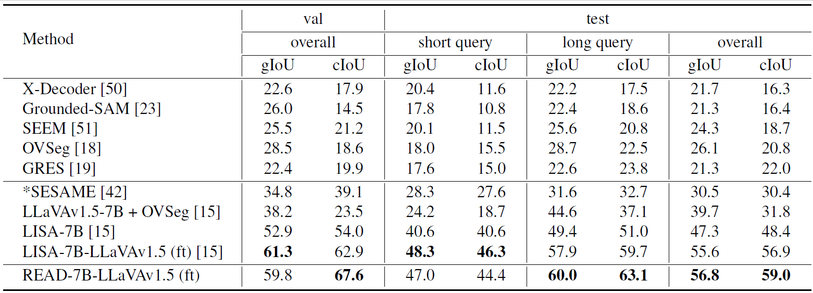
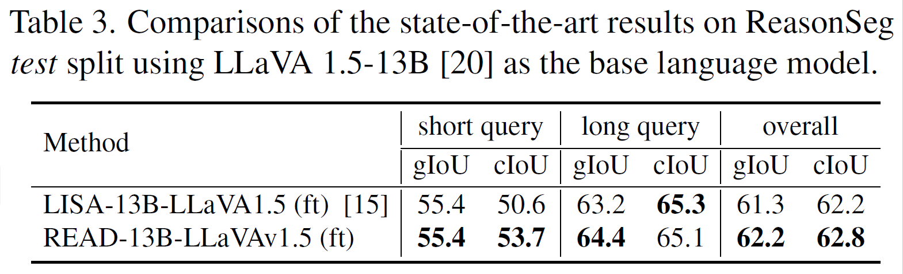
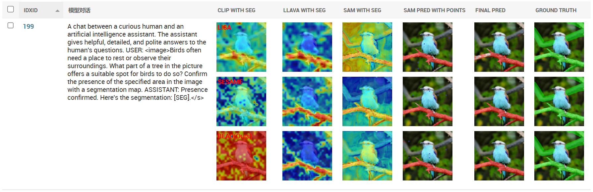

# Reasoning to Attend: Try to Understand How \<SEG\> Token Works

[](https://lbesson.mit-license.org/)  [](https://arxiv.org/abs/2412.17741) 

This repo provides the PyTorch source code of our paper: [Reasoning to Attend: Try to Understand How \<SEG\> Token Works](https://arxiv.org/abs/2412.17741).

**Authors**: 
[Rui Qian](https://scholar.google.com.hk/citations?user=z3sAW3oAAAAJ&hl=zh-CN), 
[Xin Yin](https://scholar.google.com.hk/citations?hl=zh-CN&user=v3OOQQkAAAAJ), 
[Dejing Dou†](https://scholar.google.com.hk/citations?hl=zh-CN&user=qBHsQ04AAAAJ). 

## Abstract
Current Large Multimodal Models (LMMs) empowered visual grounding typically rely on \<SEG\> token as a text prompt to jointly optimize the vision-language model (e.g., LLaVA) and the downstream task-specified model (\eg, SAM). However, we observe that little research has looked into how it works. In this work, we first visualize the similarity maps, which are obtained by computing the semantic similarity between the \<SEG\> token and the image token embeddings derived from the last hidden layer in both the LLaVA encoder and SAM decoder. Intriguingly, we have found that a striking consistency holds in terms of activation responses in the similarity map, which reveals that what \<SEG\> token contributes to is the semantic similarity within image-text pairs. 
Specifically, \<SEG\> token, a placeholder expanded in text vocabulary, extensively queries among individual tokenized image patches to match the semantics of an object from text to the paired image while the Large Language Models (LLMs) are being fine-tuned. Upon the above findings, we present **READ**, which facilitates LMMs' resilient **REA**soning capability of where to atten**D** under the guidance of highly activated points borrowed from similarity maps. Remarkably, READ features an intuitive design, Similarity as Points module (SasP), which can be seamlessly applied to \<SEG\>-like paradigms in a plug-and-play fashion.
Also, extensive experiments have been conducted on the ReasonSeg and RefCOCO(+/g) datasets. To validate whether READ suffers from 
catastrophic forgetting of previous skills after fine-tuning, we further assess its generation ability on an augmented FP-RefCOCO(+/g) dataset. All codes and models are publicly available at 
[https://github.com/rui-qian/READ](https://github.com/rui-qian/READ).
<p align="center">  </p>
<p align="center">  </p>

## News
- [x] [2025.1.21] The current code is somewhat messy, but we are confident that the results from the paper can be reproduced if all parameters are correctly set. If time permits, we will refactor the current code. stay tuned!
- [x] [🚨2025.1.21] **We released [READ-LLaVA-v1.5-13B](https://huggingface.co/rui-qian/READ-LLaVA-v1.5-13B-for-ReasonSeg-testset) for ReasonSeg dataset!** Also, since our base code is mainly adapted from SESAME. If you're working within the SESAME environment, you should be able to run it smoothly by simply downloading 
[READ-13B](https://huggingface.co/datasets/rui-qian/misc/blob/main/READ-13b.zip) there.
- [x] [2025.1.4] Inference code and the [READ-LLaVA-v1.5-7B](https://huggingface.co/rui-qian/READ-LLaVA-v1.5-7B-for-ReasonSeg-valset) model are released. Welcome to check them out!
- [x] [2024.12.24] [Paper](https://arxiv.org/abs/2412.17741) is released and GitHub repo is created.

## Installation Guide

### System Requirements

- System Setup: Linux with one or more Nvidia A100 GPUs (Ampere GPUs required due to flash-attn usage during training). Minor adjustments may be necessary for Mac or Windows.
- Dependency Installation: Create a Python environment named "ml" and install necessary dependencies:

```bash=
conda create -n ml python=3.9
pip3 install pybind11==2.11.1
pip3 install -r requirements.txt 
pip install flash-attn --no-build-isolation
```
We primarily follow the installation steps of [SESAME](https://github.com/see-say-segment/sesame). As long as your program can run the SESAME model, it should be able to run our model as well.
In addition, we also provide conda environment contents in a .zip file for convenience. Please follow the below steps to set up the environment, 
- Download `ml_conda_env.zip` from the [huggingface link](https://huggingface.co/datasets/rui-qian/misc/blob/main/ml_conda_env.zip).
- Extract the downloaded `zip` file: 
```bash
bash Anaconda3-2024.06-1-Linux-x86_64.sh
conda create -n ml python=3.9
unzip ml_conda_env.zip #(unzip to obtain ml env)
cp -a ./ml anaconda3/envs #replace
```
- Activate the environment, and adjust the relevant path as indicated by the error message:
```bash
conda activate ml
```

## Model and Dataset Preparation

Currently, we release three models are specifically trained for Reasoning segmentation tasks, (FP-)referring segmentation tasks. Below are key notes of these models. Links to [FP-RefCOCO* Datasets](https://drive.google.com/file/d/1mA3kcY3QiAZz1Zr89MCKYd7e3LBIwUzl/view?usp=sharing) are available. Visit [SESAME dataset page](./dataset/README.md) for more details.

| Model Name | HG-ckpt URL | 
|----------------------------|----------------|
| SESAME-    LLaVA-v1.5-7B  | [tsunghanwu/SESAME_minus](https://huggingface.co/tsunghanwu/SESAME_minus) |  
| SESAME    LLaVA-v1.5-7B  | [tsunghanwu/SESAME](https://huggingface.co/tsunghanwu/SESAME) |   
| READ-LLaVA-v1.5-7B-for-fprefcoco **(ours)**  | [rui-qian/READ-7B-fprefcoco](https://huggingface.co/rui-qian/READ-LLaVA-v1.5-7B-for-fprefcoco) | 
| READ-LLaVA-v1.5-7B-for-ReasonSeg-valset **(ours)**  | [rui-qian/READ-7B-ReasonSeg-valset](https://huggingface.co/rui-qian/READ-LLaVA-v1.5-7B-for-ReasonSeg-valset) | 
| READ-LLaVA-v1.5-7B-for-ReasonSeg-testset **(ours)**  | [rui-qian/READ-7B-ReasonSeg-tesset](https://huggingface.co/rui-qian/READ-LLaVA-v1.5-7B-for-ReasonSeg-testset) | 
| **READ-LLaVA-v1.5-13B-for-ReasonSeg-testset (ours)**  | [rui-qian/READ-13B-ReasonSeg-tesset](https://huggingface.co/rui-qian/READ-LLaVA-v1.5-13B-for-ReasonSeg-testset) | 

**Notes**
- As for Reasoning segmentation, we trained two models: READ-7B and READ-13B. For **READ-7B**, we initialize the parameters using the released SESAME model to accelerate training, with the training dataset allocated in a 10:1:1:1:1:10 ratio. We employ LoRA for efficient fine-tuning, using \( lora\_r = 8 \), and conduct end-to-end joint training. For **READ-13B**, we train it from scratch, using LLaVA 1.5-13B as the base model. Initially, we train it on the full dataset in a 10:10:2:3:1:1 ratio for about 8 epochs, and then fine-tune it with a ratio of 3:10:2:3:1:10, using a learning rate of 0.0001 and \( lora\_r = 64 \).
- The SESAME- model is exclusively trained with RefCOCO* data, according to [SESAME](https://github.com/see-say-segment/sesame).
- The SESAME model is trained with multiple datasets: LLaVA VQA, RefCOCO*, R-RefCOCO*, and the proposed FP-RefCOCO* data, according to [SESAME](https://github.com/see-say-segment/sesame).
## Experimental results 
### Results on ReasonSeg Dataset

**Using the complex question templates from SESAME**

<p align="left">  </p>

**Using the simple, fixed templates from LISA**

<p align="left">  </p>
<p align="left">  </p>

\* when training, for **READ-7B**, set ./train_read.py: lora_r=8, lr=0.0003, 
model/READ.py: Line 837-839, num_points = 30, t_pos = 0.8, t_neg = 0.2; Line 764, down_sample=2. 
For **READ-13B**, first, set ./train_read.py: lora_r=64, lr=0.0003, ./train_read.sh: SAMPLE_RATES_REASONSEG="10,10,2,3,1,1", model/READ.py: Line 837-839, num_points = 10, t_pos = 0.8, t_neg = 0.2; Line 764, down_sample=1. Next, 
fine tune the model, set lr=0.0001, num_points = 30, SAMPLE_RATES_REASONSEG="3,10,2,3,1,10".

\* The `conversation_records.pickle` file is no longer necessary. To enhance the diversity of the model's responses, we retained the complex question templates from SESAME. The `conversation_records.pickle` file was originally intended to preserve the question templates used during model saving. However, **we found that using the simple, fixed templates from LISA during validation can significantly improve the model's performance.**
```
    DEFAULT_IMAGE_TOKEN = "<image>"
    SHORT_QUESTION_TEMPLATE = [
        DEFAULT_IMAGE_TOKEN
        + "\n"
        + "What is {class_name} in this image? Please output segmentation mask."
    ]
    LONG_QUESTION_TEMPLATE = [
        DEFAULT_IMAGE_TOKEN
        + "\n"
        + "{sent} Please output segmentation mask.",
    ]
    LONG_ANSWER_TEMPLATE = ["Sure, the segmentation result is [SEG]."]
```

\* Considering that the ReasonSeg validation set only contains 200 images, there may be high variance on the validation set (see [issues](https://github.com/dvlab-research/LISA/issues/82)). For the READ-13B model, we only report results on the test set (700 images). Since the test set is larger than the validation set, the results are relatively more stable, and thereby, we believe this is sufficient to demonstrate the model's effectiveness.

### Results on RefCOCO Dataset
<p align="left">  </p>

### Results on FP-RefCOCO(+/g) Dataset
<p align="left">  </p>

See also: You can download the predicted results on FP-RefCOCO(+/g) [here](https://huggingface.co/datasets/rui-qian/FP-refcoco)!


</details>

## Training

### Pre-trained weights
#### SAM ViT-H weights
Download SAM ViT-H pre-trained weights from the [link](https://dl.fbaipublicfiles.com/segment_anything/sam_vit_h_4b8939.pth).
#### LLaVA
To train READ-7B or 13B from scratch, you need to download
```
huggingface-cli download  --resume-download liuhaotian/llava-v1.5-7b --local-dir llava-v1.5-7b
huggingface-cli download  --resume-download liuhaotian/llava-v1.5-13b --local-dir llava-v1.5-13b
```
or fine-tune SESAME models directly by simply running ours scripts: **[./train_read.sh](./train_read.sh)**.
```
vim SESAME-LLaVA-v1.5-7B/config.json
  "architectures": [
    "SESAMEForCausalLM" -->(modify) "READForCausalLM"
  ],

deepspeed --include $GPU_SETTINGS --master_port=$MASTER_PORT train_read.py \
      --version="$VERSION" \
      --model_max_length="$MODEL_MAX_LENGTH" \
      --vision_tower="$VISION_TOWER" \
      --dataset_dir="$DATASET_DIR" \
      --vision_pretrained="$VISION_PRETRAINED" \
      --exp_name="$EXP_NAME" \
      --dataset="$DATASET_REASONSEG" \
      --sample_rates="$SAMPLE_RATES_REASONSEG" \
      --batch_size=$BATCH_SIZE \
      --grad_accumulation_steps $GRAD_ACCUMULATION_STEPS \
      --num_classes_per_sample=$NUM_CLASSES_PER_SAMPLE \
      --auto_resume \
      --lr=0.0001
```
Since the ReasonSeg dataset is quite small, it is recommended to use a smaller learning rate of 0.0001 (instead of the original 0.0003) if you are about to fine-tune based on SESAME models. 8 epoches should be able to reproduce our results on ReasonSeg dataset. As for more details, please refer to **[train_read.sh](./train_read.sh)**.
### Merge LoRA Weight
When training is finished, to get the full model weight:
```
cd ./runs/READ-LLaVA-v1.5-7B/ckpt_model && python zero_to_fp32.py . ../pytorch_model.bin 
```
or using script **[merge_lora_weight.sh](./merge_lora_weight.sh)**. 

### Validation on ReasonSeg and refcoco(+/g) series

To validate on ReasonSeg and referring segmentation dataset, by simply running ours scripts: **[./val_read.sh](./val_read.sh)**.   You may modify the parameters accordingly if needed.

```
# uncomment to eval for ReasonSeg val set
deepspeed --master_port=24996 --include "localhost:0" train_read.py \
       --version="./READ-LLaVA-v1.5-7B-for-ReasonSeg-valset" \
       --dataset_dir='../dataset' \
       --vision_pretrained="../dataset/sam_vit_h_4b8939.pth" \
       --eval_only \
       --vision_tower="../dataset/clip-vit-large-patch14-336" \
       --model_max_length=2048 \
       --val_dataset="ReasonSeg" \
       --val_split="val"
```

### Validation on FP-refcoco(+/g) series

Unlike the ReasonSeg and RefCOCO(+/g) datasets, where the dataset contains only positive samples and evaluation focuses solely on segmentation performance, the `<seg>` token is directly added to the question template during validation. However, the FP-RefCOCO dataset includes False Premises (negative samples), so the `<seg>` token cannot be directly appended to the question template. Instead, the model should make predictions directly based on the given query. You 
can simply run ours scripts: **[./test_read.sh](./test_read.sh)**. 
```
CUDA_VISIBLE_DEVICES="${CUDA_DEVICE}" python test_read.py \
    --cmd="${INFERENCE_CMD}" \
    --local_rank=0 \
    --process_num="${PROCESS_NUM}" \
    --world_size="${WORLD_SIZE}" \
    --dataset_dir ../dataset \
    --pretrained_model_path="./READ-LLaVA-v1.5-7B-for-fprefcoco" \
    --vision_tower="../dataset/clip-vit-large-patch14-336" \
    --model_max_length=2048 \
    --val_dataset="${DATASET}" \
    --vis_save_path="./inference_results/${DATASET}_inference_cvpr"
```
As mentioned in [SESAME](https://github.com/see-say-segment/sesame), inference is highly time-consuming. Using a single A100 80G GPU, it takes approximately 8-9 hours to perform inference on a FP-refcoco(+/g) series.


## Inference (Demo)

To chat with [READ-LLaVA-v1.5-7B](READ-LLaVA-v1.5-7B-for-fprefcoco), you can run ours scripts: **[./demo.sh](./demo.sh)**.
```
export CUDA_VISIBLE_DEVICES=0
python demo.py \
    --pretrained_model_path="../READ-LLaVA-v1.5-7B-for-fprefcoco" \
    --vision_tower="../dataset/clip-vit-large-patch14-336" \
    --model_max_length=2048
```

## Appendix
To qualitatively analyze the \<SEG\> token, we visualize the similarity maps at different stages of the forward pass in SESAME. 
Here are the relevant experimental results attached [Link](https://huggingface.co/datasets/rui-qian/misc/blob/main/Analysis.tar.gz).
```
tar -xvf Analysis.tar.gz
cd Analysis
./run.sh    # We provide a Django-based dashboard for data visualization. User: llm  Password: 1314
```
<p align="center">  </p>

## Acknowledgements

We are grateful for the foundational code provided by [SESAME](https://github.com/see-say-segment/sesame), [CLIP_Surgery](https://github.com/xmed-lab/CLIP_Surgery),[LISA](https://github.com/dvlab-research/LISA), [LLaVA](https://github.com/haotian-liu/LLaVA), and [SAM](https://github.com/facebookresearch/segment-anything). Utilizing their resources implies agreement to their respective licenses. Our project benefits greatly from these contributions, and we acknowledge their significant impact on our work.

## Citation

If you use our work or our implementation in this repo, or find them helpful, please consider giving a citation.
```
@inproceedings{qian2024reasoning,
  title={Reasoning to Attend: Try to Understand How< SEG> Token Works},
  author={Qian, Rui and Yin, Xin and Dou, Dejing},
  journal={arXiv preprint arXiv:2412.17741},
  year={2024}
}
```
## Contact
If you have any questions, feel free to reach out at qianruii@126.com, xyin@zju.edu.cn, and dejingdou@gmail.com.
